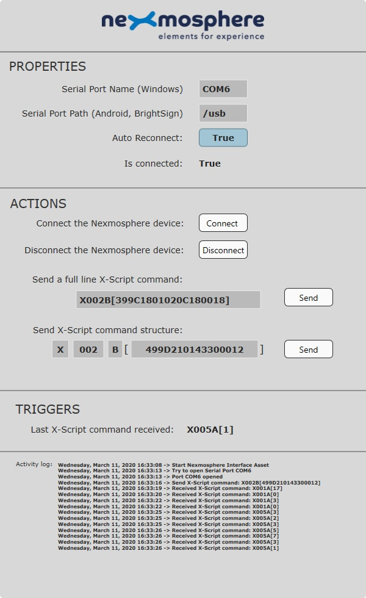

# Nexmosphere Interface Asset for Intuiface

This project contains a Nexmosphere Interface Asset for Intuiface Player & Composer.

The [Nexmosphere](https://nexmosphere.com) Interface Asset enables you to communicate with Nexmosphere devices from within an Intuiface experience running on Windows or Android devices.

This Interface Asset was developed to communicate with all Nexmosphere controllers:
* [XN RANGE | NANO CONTROLLERS](https://nexmosphere.com/product-category/xn-nano/)
* [XM RANGE | MODULAR CONTROLLERS](https://nexmosphere.com/product-category/xm-range/)

Meaning it handles all of the following elements:
* [XY RANGE | X-EYE ELEMENTS](https://nexmosphere.com/product-category/xy-range/)
* [XR-RANGE | WIRELESS PICK-UP DETECTION](https://nexmosphere.com/product-category/xr-range/)
* [XW RANGE | X-WAVE LED CONTROL](https://nexmosphere.com/product-category/xw-range/)
* [XT RANGE | TOUCH BUTTONS](https://nexmosphere.com/product-category/xt-range/)
* [XD RANGE | X-DOT ELEMENTS](https://nexmosphere.com/product-category/xd-range/)
* [XS-RANGE | X-SNAPPER ELEMENTS](https://nexmosphere.com/product-category/xs-range/)
* ...

It comes with a default Design Accelerator that will enable you to easily test your Nexmosphere device connection within Intuiface Composer.

For more information about Nexmosphere and this interface asset, see our article about [using Nexmosphere within Intuiface](https://support.intuiface.com/hc/en-us/articles/360009681439) within the [Intuiface Help Center](https://support.intuiface.com/hc/en-us).

# How to use the Nexmosphere Interface Asset?

**NOTE**: Starting with Composer Version 6.5.1, a Nexmosphere Interface Asset containing the baseline set of capabilities outlined here can be accessed directly through Composer's Interface Assets panel. Only complete the following steps if you have modified the interface asset in some way.

To add a modified Nexmosphere Interface Asset into an Intuiface experience, follow these steps:

* Close all running instances of **Intuiface Composer**.
* Download the [latest released package here](https://github.com/intuiface/NexmosphereIA/releases).
* Extract the archive, open the resulting OutputInterfaceAsset folder, and copy the **Nexmosphere** folder to the path "[Drive]:\Users\\[UserName]\Documents\Intuiface\Interface Assets".
* Launch **Intuiface Composer** and open your project.
* Open the Interface Asset panel and select the **Add an Interface Asset** option. When you enter "Nexmosphere" in the search bar, you should see the **Nexmosphere** Interface Asset.

# How to build this project?

**PREREQUISITES**: You must use Visual Studio and have .NET installed.

The Nexmosphere Interface Asset is coded both in C# and JavaScript.

To build this project, follow these steps:
* Open **Nexmosphere.sln** in Visual Studio 2013 or above,
* Build the solution in **Release** mode,
* Navigate to the root of the project and look for a folder named **OutputInterfaceAsset** which contains the Nexmosphere Interface Asset.

_Building this project will also copy the JavaScript code required for running the Interface Asset on Android devices_

If you want to make your own Interface Asset enhancements, review the following articles in the [Intuiface Help Center](https://support.intuiface.com/hc/en-us):

* [Create a .NET Interface Asset](https://support.intuiface.com/hc/en-us/articles/360007179792-Create-a-NET-Interface-Asset)
* [Create a JavaScript Interface Asset](https://support.intuiface.com/hc/en-us/articles/360007179772-Create-a-JavaScript-Interface-Asset)

-----

Copyright &copy; 2020 Intuiface.

Released under the **MIT License**.

